<p align="center">
  <h1 align="center">ServiceTrack</h1>
  <h4 align="center">Frontend for ServiceTrack application to track all service orders</h4>
</p>

---

## Introduction

**ServiceTrack** is a service management platform enabling users to track and manage service orders efficiently.

The application provides a dashboard for admins and technicians, allowing management of service orders, clients, technicians, and generated reports. With built-in authentication and role-based UI, users can view or assign orders, register, and monitor their work progress.

---

## Getting started

1. Install dependencies
```npm install```

2. Start the app
```npm start```

##  Screenshots
Following screenshots showcase functionalities of the app.

### 1. Technician view
### Login & Registration
| Login | Registration |
|-------|--------------|
| 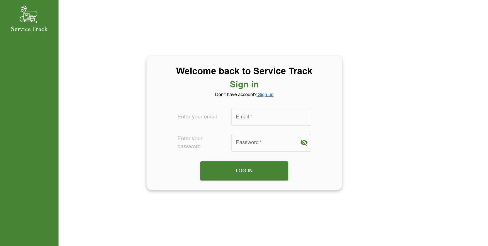 | 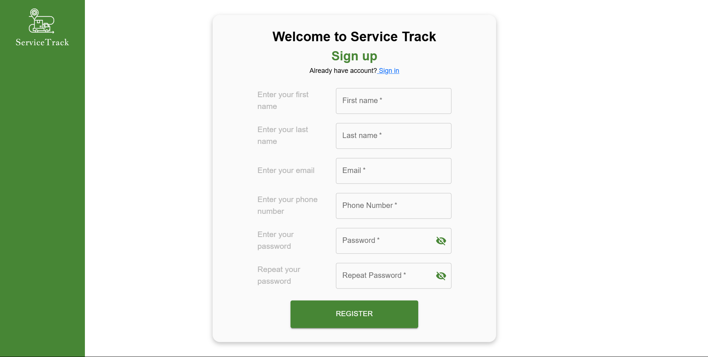 |

---
### Clients List
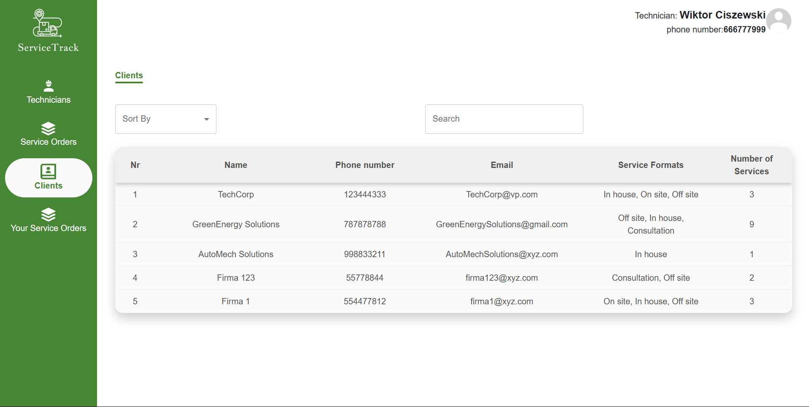
---
---
### Technicians List
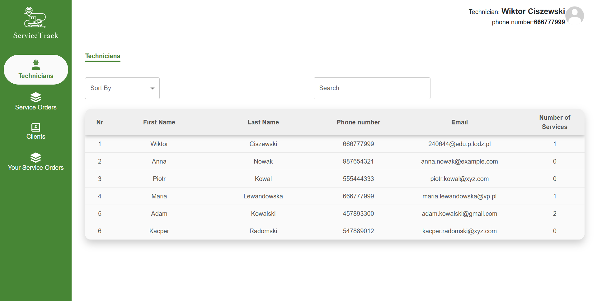


### Service Orders
| Service Orders | Add Order |
|----------------|------------------------|
| 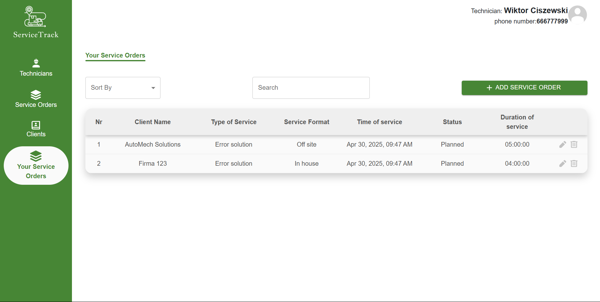 | 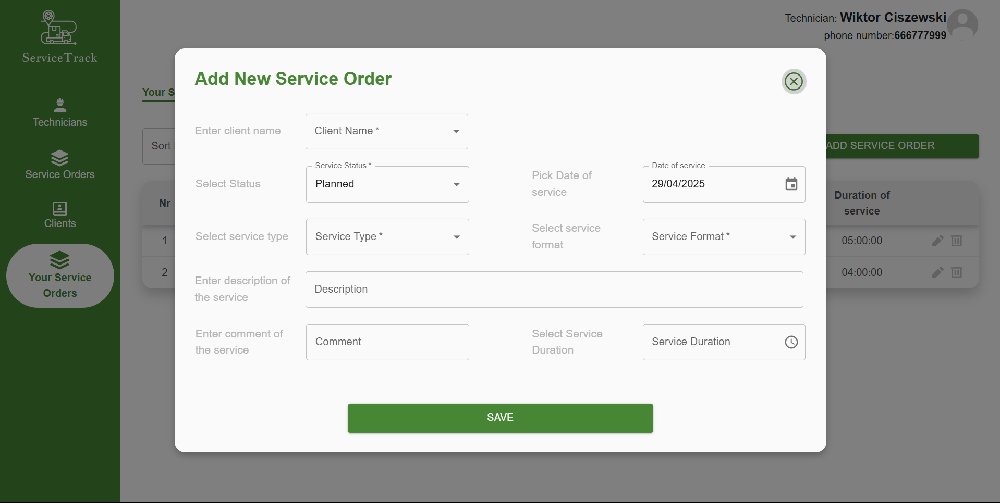 |


---
### Profile
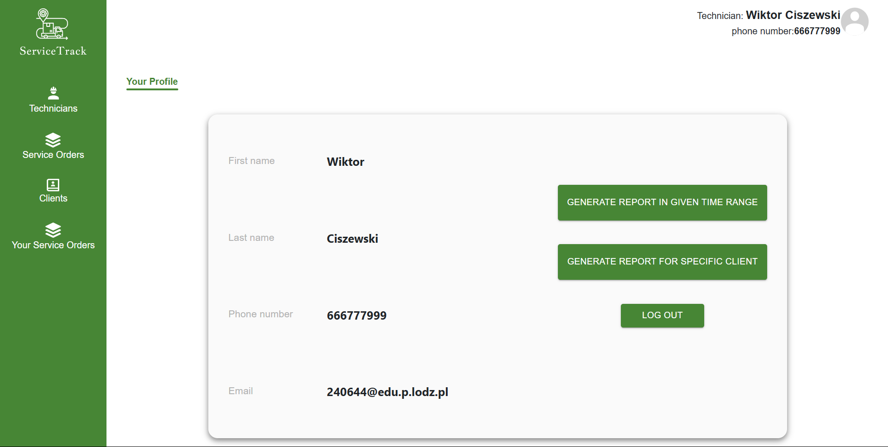

---

### Reports
| Generate Report | Report for Client |
|------------------|-------------------|
| 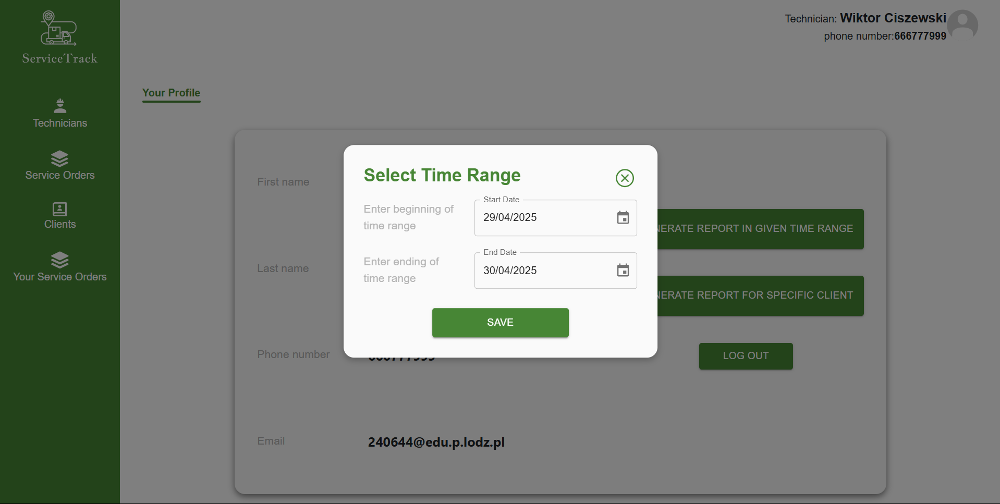 | 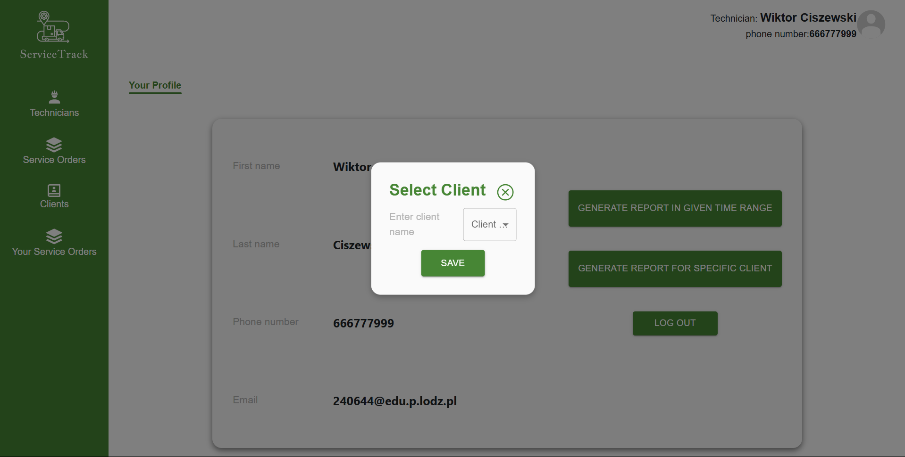 |

---
### 2. Admin view

### Clients Management
| Add Client   | Edit Client                                     |
|--------------|-------------------------------------------------|
|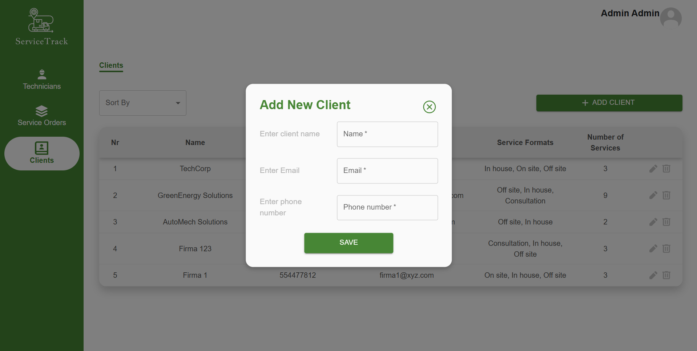| 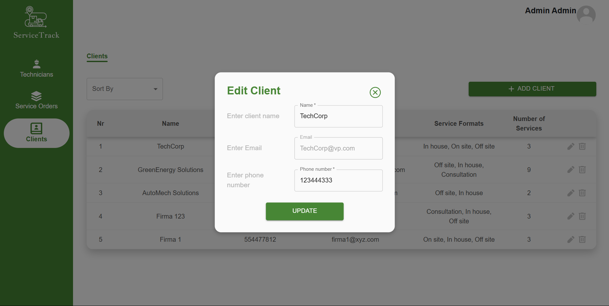 |

---

### Technicians Management
| Add Technician | Edit Technician |
|----------------|-----------------|
| 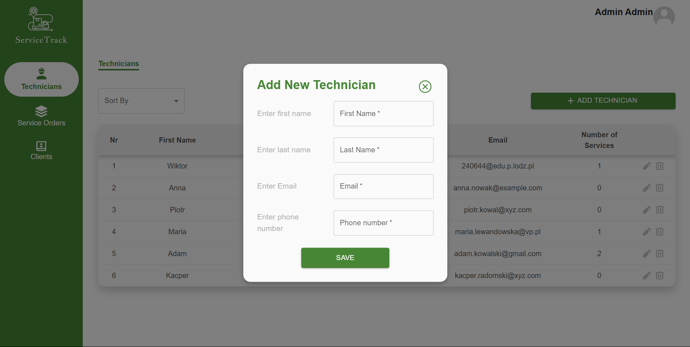 |  |

---

### Service Orders
| Add Order                                    | Edit Order                                             |
|-------------------------------------------------------|--------------------------------------------------------|
|  | 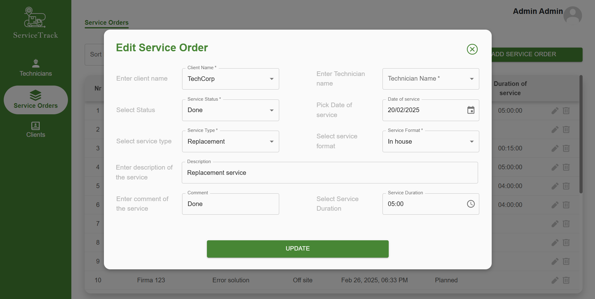 |
